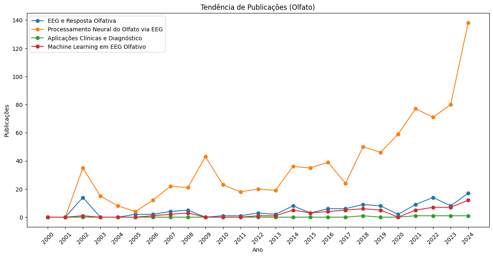
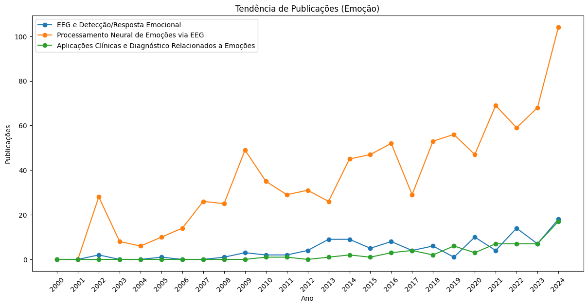

## Pergunta de pesquisa:
**"É possível identificar padrões neurais associados à sensação de segurança ou ameaça em ambientes urbanos simulados, modulados por estímulos olfativos?"**

---
## Tendências:

## Ideia central:
Investigar como **odores ambientais** (agradáveis como lavanda, ou desagradáveis como lixo ou fumaça) influenciam a **percepção emocional de segurança** em cenários urbanos simulados, usando EEG para detectar **respostas de ameaça ou tranquilidade**.

---

## Abordagem experimental:
- Participantes são expostos a **imagens ou vídeos de ambientes urbanos** (ex: rua mal iluminada vs parque arborizado).
- Durante a exposição, são liberados **odores contextuais** (agradáveis, neutros, desagradáveis).
- EEG é registrado, buscando **ativação associada ao medo ou sensação de segurança** 

---

## Possibilidades de análise:
- Índices de **arousal emocional** e **valência** via EEG.
- Potenciais evocados emocionais (ex: LPP).
- Coerência entre regiões frontais e límbicas.
- Correlações com escalas de ansiedade urbana ou bem-estar ambiental.

---

## Relevância social:
- Pode informar o **design sensorial de cidades mais humanas e seguras** (ex: aromatização de espaços públicos).
- Aumenta a compreensão da relação entre **emoções, ambiente físico e sensação de segurança**.
- Aplica EEG fora do laboratório, aproximando ciência e vida cotidiana.
