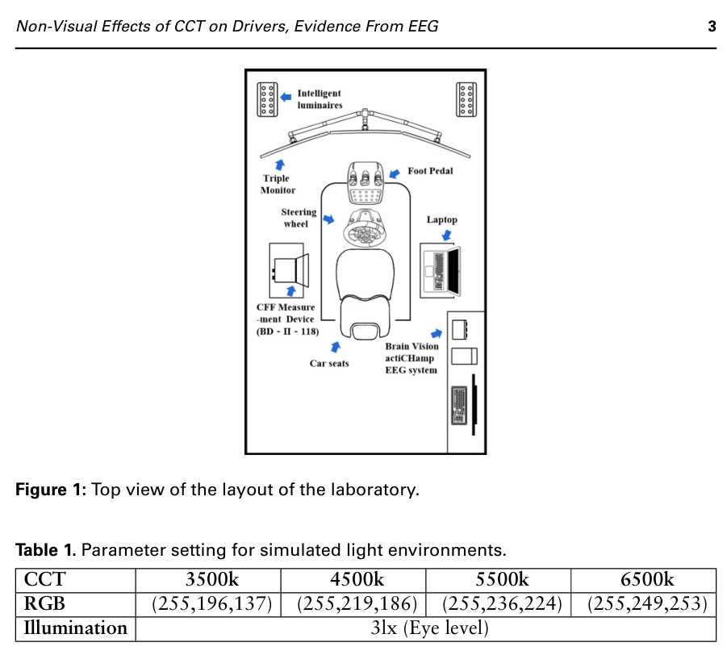

# Articles
##  Non-Visual Effects of CCT on Drivers, Evidence From EEG
### Resumo
Efeitos da iluminação interna no humor e desempenho humanos, motivado, entre outros motivos, pelo fato de mais da metade dos acidentes de transito fatais ocorrerem à noite.
  
2001: Descoberta das células ipRGCs mais sensíveis a luz azul entre 460 e 490 nm. Respostas de projeção neural em diversas áreas do cérebro, afetando humor, secreção hormonal, estado de alerta e outros processos cognitivos.
  
Artigo avalia motoristas em vias urbanas ao invés de vias "externas", pois representam um ambiente mais controlado, com menos sinais disponíveis para o motorista e menos perigos potenciais. Também justifica o uso de EEG por ser um método mais confiável que questionários e análises comportamentais.
  
Avaliam os efeitos não visuais da iluminação em motoristas quanto ao humor, estado de alerta e fadiga, usando de:
- coleta dos sinais de EEG;
- frequência crítica de cintilação (CFF);
- tempo de reação (TR);
- resultados do questionário de avaliação subjetiva.
  
### Métodos
- Níveis de CCT (iluminação): 3500 vs. 4500k vs. 5500k vs. 6500k;
- Exposição: 50 minutos (entre 19:00 e 20:10);
- Intervalo: 4 dias;
- Intervalo do estudo: Maio a Agosto de 2022;
  
  

Imagem de: [artigo originial](https://doi.org/10.54941/ahfe1002815)  
  
Fase 1: Direção sem estímulos na estrada além do tréfego circundante, mantendo uma velocidade constante de 60 km/hora e obedecendo leis de trânsito. Base para níveis de humor.
Fase 2: Constantes sinais vermelhos e engarrafamentos, com mesmos requerimentos da fase 1. Avaliar padrões de mudanças nos níveis de humor em diferentes condições de iluminação
Fase 3: Seguir um veículo alvo mantendo uma distância de segurança e pressionando uma tecla ao receber um estímulo acústico de 3 segundos aleatório com intervalo de 50-70 segundos (tarefa secundária).
  
O estudo focou na análise das ondas alfa (8-13 Hz) registradas nas regiões pré-frontais do cérebro esquerdo e direito. A razão entre os valores espectrais de potência das ondas alfa do cérebro esquerdo e as do cérebro direito ($\alpha_{(L/R)}$) foi usada como um indicador de avaliação do humor (confronto entre humores negativos e positivos gerados pelo sujeito durante a condução). Se a proporção for maior, significa que o humor geral do sujeito tende a ser mais negativo.

### Conquistas
- O estudo conseguiu resultados que indicam que, nas condições dadas, valores maiores de CCT tendem a afetar negativamente os níveis de humor de condutores, enquanto melhores níveis de humor tendem a aparecer com valores médios de CCT. Entretanto, mais estudos devem ser feitos para determinar melhores condições de iluminação para uma avaliação mais abrangente.

### Voluntários
- 21 no total
- 16 Homens, 5 Mulheres
- Habilitados a dirigir, com média de 4.5 +- 1.01 anos de condução;
- Todos com visão normal e destros, livres de transtornos de humor e doenças crônicas;
- Sem exposição à luz especial na semana anterior e com sono suficiente no dia anterior (Cerca de 8 horas de sono), sem café, chá forte, etc;

[artigo originial](https://doi.org/10.54941/ahfe1002815)